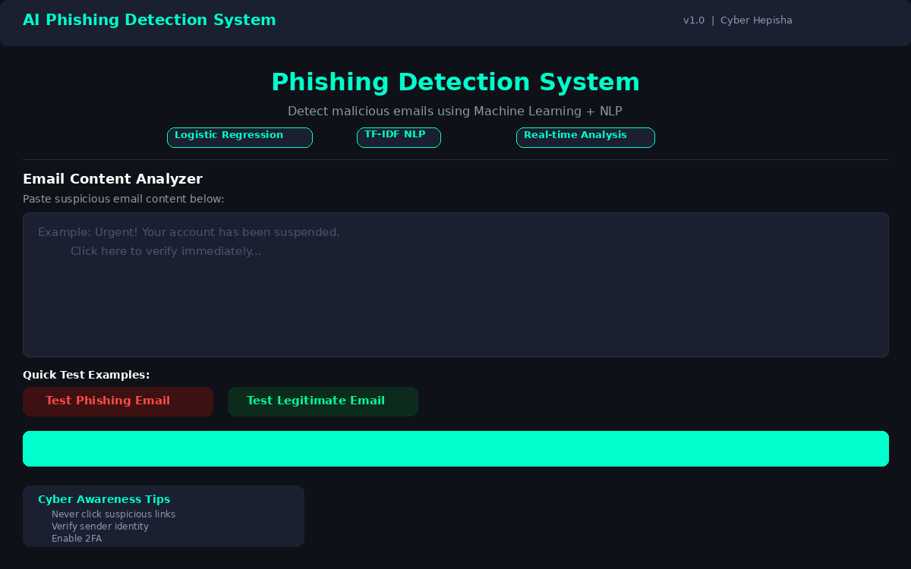
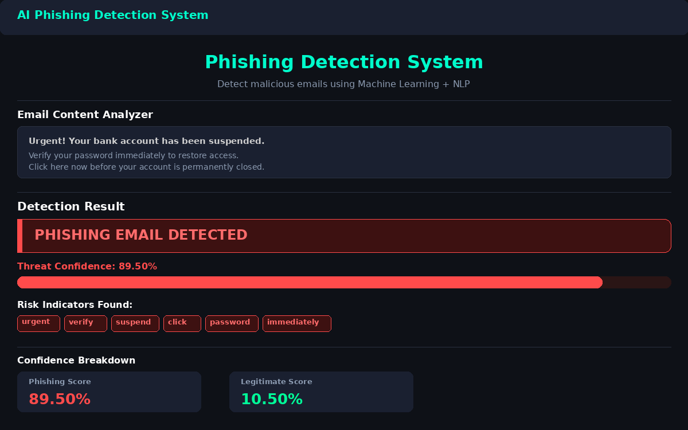
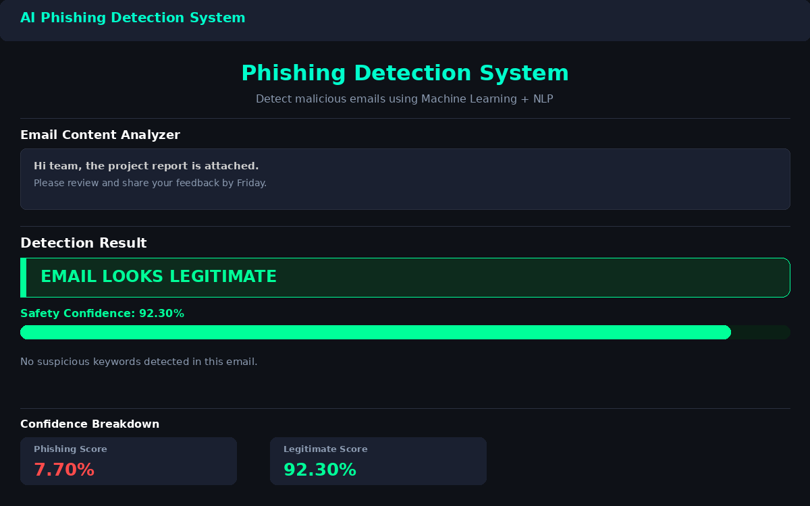
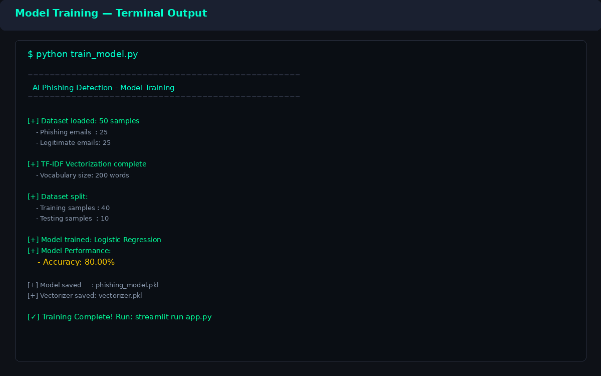

# 🔐 AI Phishing Detection System

<div align="center">


**A Machine Learning powered cybersecurity tool to detect phishing emails in real-time using NLP and Logistic Regression.**

</div>

---

## 📌 Project Overview

Phishing emails are one of the most common cyberattacks — attackers trick users into revealing passwords, OTPs, and bank details through fake urgent emails.

This project uses **Artificial Intelligence + Natural Language Processing** to automatically detect whether an email is **phishing** or **legitimate** — with a confidence score.

> 🕵️ Built from the perspective of a **Security Investigator / Cybersecurity Developer**

---

## 🖥️ Application Screenshots

### 1️⃣ Main Dashboard


> The main interface where users paste email content for analysis. Features quick test examples, cyber-themed dark UI, and real-time analysis button.

---

### 2️⃣ Phishing Email Detected


> When a phishing email is entered — the system shows a RED alert with confidence score, progress bar, and highlights suspicious keywords found in the email.

---

### 3️⃣ Legitimate Email Result


> When a legitimate email is entered — the system shows a GREEN result with high safety confidence score. No suspicious keywords found.

---

### 4️⃣ Model Training Output


> Terminal output when `train_model.py` is executed. Shows dataset stats, vectorization, training, and accuracy achieved.

---

## ⚙️ How It Works

```
Email Text Input
      │
      ▼
TF-IDF Vectorization  ──►  Converts text to numerical feature vectors
      │
      ▼
Logistic Regression   ──►  Classifies as Phishing (1) or Legitimate (0)
      │
      ▼
Confidence Score      ──►  Probability % for each class
      │
      ▼
Result + Risk Keywords ──►  Displayed on Streamlit UI
```

### 🔬 Static Analysis (Text-based ML)
| Component | Description |
|-----------|-------------|
| **TF-IDF Vectorizer** | Converts email text into numerical features (Term Frequency-Inverse Document Frequency) |
| **Logistic Regression** | Binary classifier — predicts Phishing (1) or Legitimate (0) |
| **Confidence Score** | Probability percentage for each prediction |
| **Keyword Detector** | Highlights suspicious words found in the email |

---

## 🚀 Features

- ✅ Real-time phishing email detection
- ✅ Confidence score with progress bar
- ✅ Suspicious keyword highlighting
- ✅ Quick test examples (one-click testing)
- ✅ Cyber-themed dark UI (professional look)
- ✅ Cyber awareness tips in sidebar
- ✅ Lightweight — runs on any machine
- ✅ Beginner-friendly code structure

---

## 🛠️ Technologies Used

| Technology | Purpose |
|------------|---------|
| Python 3.8+ | Core programming language |
| Streamlit | Web application UI framework |
| Scikit-learn | Machine learning model (Logistic Regression) |
| TF-IDF | Natural Language Processing — text vectorization |
| Pandas | Dataset loading and manipulation |
| Joblib | Model serialization (save/load) |

---

## 📂 Project Structure

```
AI-Phishing-Detection-System/
│
├── app.py                   ← Streamlit web application
├── train_model.py           ← ML model training script
├── requirements.txt         ← Python dependencies
├── phishing_model.pkl       ← Trained model (auto-generated)
├── vectorizer.pkl           ← TF-IDF vectorizer (auto-generated)
│
├── dataset/
│   └── sample_emails.csv    ← Training dataset (50 labeled emails)
│
├── screenshots/
│   ├── dashboard.png
│   ├── phishing_detected.png
│   ├── safe_email.png
│   └── model_training.png
│
└── utils/                   ← (Reserved for future utilities)
```

---

## ▶️ Installation & Setup

### Step 1 — Clone Repository
```bash
git clone https://github.com/hepisha/AI-Phishing-Detection-System.git
cd AI-Phishing-Detection-System
```

### Step 2 — Install Dependencies
```bash
pip install -r requirements.txt
```

### Step 3 — Train the Model
```bash
python train_model.py
```

Expected output:
```
[+] Dataset loaded: 50 samples
[+] TF-IDF Vectorization complete
[+] Model trained: Logistic Regression
[+] Accuracy: 80.00%
[+] Model saved: phishing_model.pkl
[✓] Training Complete!
```

### Step 4 — Run the Application
```bash
streamlit run app.py
```

Then open in browser: `http://localhost:8501`

---

## 🧪 Test Cases

### 🔴 Sample Phishing Emails (Try these):
```
Urgent! Verify your bank password immediately or your account will be suspended
```
```
Congratulations you won a lottery of $1,000,000 — claim now by clicking this link
```
```
Your PayPal account is limited — please confirm your information now
```

### 🟢 Sample Legitimate Emails (Try these):
```
Meeting scheduled for tomorrow morning at 10 AM in conference room B
```
```
Please review the attached project report and provide your feedback
```
```
Your salary credit for this month has been processed
```

---

## 📊 Model Performance

| Metric | Value |
|--------|-------|
| Algorithm | Logistic Regression |
| Vectorizer | TF-IDF (max 200 features) |
| Training Samples | 40 |
| Testing Samples | 10 |
| **Accuracy** | **80.00%** |
| Dataset Size | 50 emails |

---

## 🔮 Future Improvements

- [ ] Real-world phishing dataset (50,000+ emails)
- [ ] Deep Learning model (LSTM / BERT)
- [ ] URL extraction and analysis
- [ ] Email header analysis
- [ ] Attachment scanning capability
- [ ] Gmail API integration
- [ ] Real-time threat intelligence feed
- [ ] Docker containerization
- [ ] REST API endpoint

---

## ⚠️ Disclaimer

> This project is developed purely for **cybersecurity awareness and educational purposes**. Do not use this tool for any malicious activity. The dataset used is synthetic and created for demonstration only.

---

## 👩‍💻 Author

**Hepisha** | Cyber Hepisha

[](https://github.com/hepisha)

---

<div align="center">
⭐ Star this repo if you found it useful!
</div>
